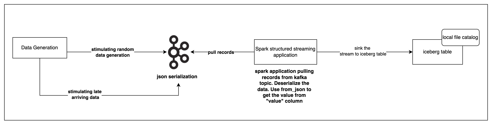

Below is the architecture diagram for the project:

### Data generation
* The data generation module is responsible for creating random data both with normal and late arriving records.
* Pydantic is used to define the data model and generate random data.
* Data should be serialized eithrr in JSON or Avro format before pushing to Kafka.

### Data processing
* A spark structured streaming job is used to consume data from Kafka topic.
* derialized data from kafka via from_avro/ from_json methods.
* perform the required transformations on the data if needed.
* push the transformed data to iceberg table.

(.venv) ➜  warehouse curl http://localhost:19120/api/v1/config
{
  "defaultBranch" : "main",
  "maxSupportedApiVersion" : 2
}% 