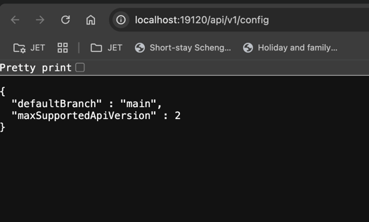

Below is the architecture diagram for the project:


### Data generation

* The data generation module is responsible for creating random data both with normal and late arriving records.
* Pydantic is used to define the data model and generate random data.
* Data should be serialized either in JSON or Avro format before pushing to Kafka.

### Data processing

* A spark structured streaming job is used to consume data from Kafka topic.
* serialized data from kafka via from_avro/ from_json methods.
* perform the required transformations on the data if needed.
* push the transformed data to iceberg table.

## How to run the project locally

### Prerequisites

* Install docker desktop
* Install task to run the tasks from Taskfile.yaml

```commandline
 brew install go-task/tap/go-task
```

* Install uv for python version management

```commandline
 pip install uv
 ```

* Follow the `Taskfile.yaml` to run the project locally. Below is one of the example commands to run the project.

```commandline
task install-python-dependencies  
```

## How to know if nessie is running

run the following command to check if Nessie is running:

```commandline
curl http://localhost:19120/api/v1/config
{
  "defaultBranch" : "main",
  "maxSupportedApiVersion" : 2
}% 
```


